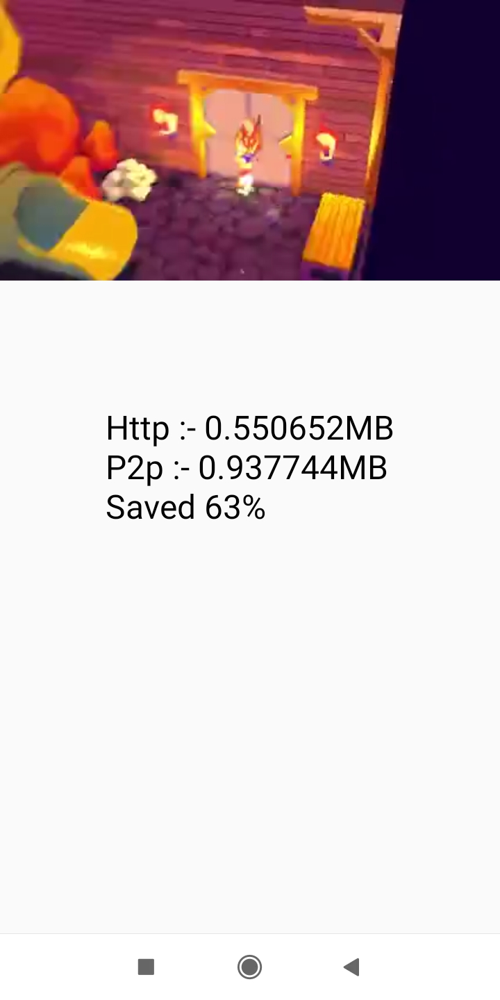

# https://grow.peervadoo.com/

Vadoo is a p2p sdk integration to reduce your video streaming costs by upto 50% and scale to 4x-7x the number of users

Vadoo is powered by webrtc which distributes the load on users to reduce the server costs and to improve scalability

**First 10 GB data free every month using P2P(Peer 2 Peer) network** 

**Features**
- Support live and VOD streams over HLS protocol(m3u8)
- Support encrypted HLS stream
- Support cache to avoid repeating the download of TS file
- Very easy to integrate with an existing Android and Android TV project
- Support any Android player
- Efficient scheduling policies to enhance the performance of P2P streaming

## Integration

To integrate with our sdk, follow the steps from here [Integration](Integration.md)

## Sample apps

To test out our sdk you can follow the examples from 

#### For generating token to use Vadoo 

Make a POST request to api.peervadoo.com/get_token?email=Your-email-id

#### To get a report of your http and p2p consumption stats

Get the token from above step

Make a GET request to api.peervadoo.com/get_stats?token=Your-token
